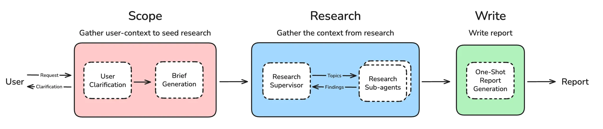

# 🧱 Deep Research From Scratch 

Deep research has broken out as one of the most popular agent applications. In this repo, we'll build a deep researcher from scratch! Here is a map of the major pieces that we will build:



## 🚀 Quickstart 

### Prerequisites

- **Node.js and npx** (required for MCP server in notebook 3):
```bash
# On Ubuntu/Debian:
curl -fsSL https://deb.nodesource.com/setup_lts.x | sudo -E bash -
sudo apt-get install -y nodejs

# Verify installation:
node --version
npx --version
```

- [uv](https://docs.astral.sh/uv/) package manager

```bash
pip install uv
```

### Installation

1. Clone the repository:
```bash
git clone git@github.com:yanfeng98/fork-deep_research_from_scratch.git
cd fork-deep_research_from_scratch
```

2. Install the package and dependencies (this automatically creates and manages the virtual environment):
```bash
uv sync
```

3. Create a `.env` file in the project root with your API keys:

```bash
touch .env
```

Add your API keys to the `.env` file:
```env
# Required for research agents with external search
TAVILY_API_KEY=your_tavily_api_key_here

# Required for model usage
OPENAI_BASE_URL=your_openai_base_url_here
OPENAI_API_KEY=your_openai_api_key_here
```

4. Run notebooks or code using uv:
```bash
# Run Jupyter notebooks directly
uv run jupyter notebook

# Or activate the virtual environment if preferred
source .venv/bin/activate
jupyter notebook
```

## Background 

Research is an open‑ended task; the best strategy to answer a user request can’t be easily known in advance. Requests can require different research strategies and varying levels of search depth. Consider this request. 

[Agents](https://langchain-ai.github.io/langgraph/tutorials/workflows/#agent) are well suited to research because they can flexibly apply different strategies, using intermediate results to guide their exploration. Open deep research uses an agent to conduct research as part of a three step process:

1. **Scope** – clarify research scope
2. **Research** – perform research
3. **Write** – produce the final report

## 📝 Organization 

This repo contains 5 tutorial notebooks that build a deep research system from scratch:

### 📚 Tutorial Notebooks

#### 1. User Clarification and Brief Generation (`notebooks/1_scoping.ipynb`)
**Purpose**: Clarify research scope and transform user input into structured research briefs

**Key Concepts**:
- **User Clarification**: Determines if additional context is needed from the user using structured output
- **Brief Generation**: Transforms conversations into detailed research questions
- **LangGraph Commands**: Using Command system for flow control and state updates
- **Structured Output**: Pydantic schemas for reliable decision making

**Implementation Highlights**:
- Two-step workflow: clarification → brief generation
- Structured output models (`ClarifyWithUser`, `ResearchQuestion`) to prevent hallucination
- Conditional routing based on clarification needs
- Date-aware prompts for context-sensitive research

**What You'll Learn**: State management, structured output patterns, conditional routing

---

#### 2. Research Agent with Custom Tools (`notebooks/2_research_agent.ipynb`)
**Purpose**: Build an iterative research agent using external search tools

**Key Concepts**:
- **Agent Architecture**: LLM decision node + tool execution node pattern
- **Sequential Tool Execution**: Reliable synchronous tool execution
- **Search Integration**: Tavily search with content summarization
- **Tool Execution**: ReAct-style agent loop with tool calling

**Implementation Highlights**:
- Synchronous tool execution for reliability and simplicity
- Content summarization to compress search results
- Iterative research loop with conditional routing
- Rich prompt engineering for comprehensive research

**What You'll Learn**: Agent patterns, tool integration, search optimization, research workflow design

---

#### 3. Research Agent with MCP (`notebooks/3_research_agent_mcp.ipynb`)
**Purpose**: Integrate Model Context Protocol (MCP) servers as research tools

**Key Concepts**:
- **Model Context Protocol**: Standardized protocol for AI tool access
- **MCP Architecture**: Client-server communication via stdio/HTTP
- **LangChain MCP Adapters**: Seamless integration of MCP servers as LangChain tools
- **Local vs Remote MCP**: Understanding transport mechanisms

**Implementation Highlights**:
- `MultiServerMCPClient` for managing MCP servers
- Configuration-driven server setup (filesystem example)
- Rich formatting for tool output display
- Async tool execution required by MCP protocol (no nested event loops needed)

**What You'll Learn**: MCP integration, client-server architecture, protocol-based tool access

---

#### 4. Research Supervisor (`notebooks/4_research_supervisor.ipynb`)
**Purpose**: Multi-agent coordination for complex research tasks

**Key Concepts**:
- **Supervisor Pattern**: Coordination agent + worker agents
- **Parallel Research**: Concurrent research agents for independent topics using parallel tool calls
- **Research Delegation**: Structured tools for task assignment
- **Context Isolation**: Separate context windows for different research topics

**Implementation Highlights**:
- Two-node supervisor pattern (`supervisor` + `supervisor_tools`)
- Parallel research execution using `asyncio.gather()` for true concurrency
- Structured tools (`ConductResearch`, `ResearchComplete`) for delegation
- Enhanced prompts with parallel research instructions
- Comprehensive documentation of research aggregation patterns

**What You'll Learn**: Multi-agent patterns, parallel processing, research coordination, async orchestration

---

#### 5. Full Multi-Agent Research System (`notebooks/5_full_agent.ipynb`)
**Purpose**: Complete end-to-end research system integrating all components

**Key Concepts**:
- **Three-Phase Architecture**: Scope → Research → Write
- **System Integration**: Combining scoping, multi-agent research, and report generation
- **State Management**: Complex state flow across subgraphs
- **End-to-End Workflow**: From user input to final research report

**Implementation Highlights**:
- Complete workflow integration with proper state transitions
- Supervisor and researcher subgraphs with output schemas
- Final report generation with research synthesis
- Thread-based conversation management for clarification

**What You'll Learn**: System architecture, subgraph composition, end-to-end workflows

---

### 🎯 Key Learning Outcomes

- **Structured Output**: Using Pydantic schemas for reliable AI decision making
- **Async Orchestration**: Strategic use of async patterns for parallel coordination vs synchronous simplicity
- **Agent Patterns**: ReAct loops, supervisor patterns, multi-agent coordination
- **Search Integration**: External APIs, MCP servers, content processing
- **Workflow Design**: LangGraph patterns for complex multi-step processes
- **State Management**: Complex state flows across subgraphs and nodes
- **Protocol Integration**: MCP servers and tool ecosystems

Each notebook builds on the previous concepts, culminating in a production-ready deep research system that can handle complex, multi-faceted research queries with intelligent scoping and coordinated execution. 
